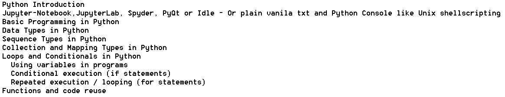

# 30Days-Of-Python-4-ETLgeeks
A 30 days of evolving course for teaching Python to ETL Datawarehouse geeks.
It is intended for teams who are migrating from traditonal ETL tools to Python on Cloud.

And Yes Informatica, Abinito , Datastage are now traditional and will soon be legacy in active warehouse landscapes.
Reach out to me if you do not agree and we will debate.

# Creating the Agenda | Day 1
Onboard the geeks and create the agenda.

## Day1_Agenda

