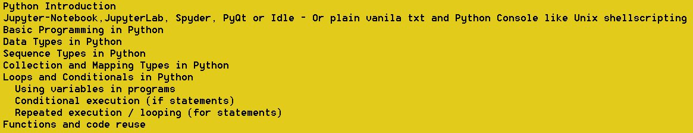

# 30Days-Of-Python-4-ETLgeeks
A 30 days of evolving course for teaching Python to ETL Datawarehouse geeks.
It is intended for teams who are migrating from traditonal ETL tools to Python on Cloud.

Reach out to me and we can debate.

# Creating the Agenda | Day 1
Onboard the geeks and create the agenda.

## Day1_Agenda

